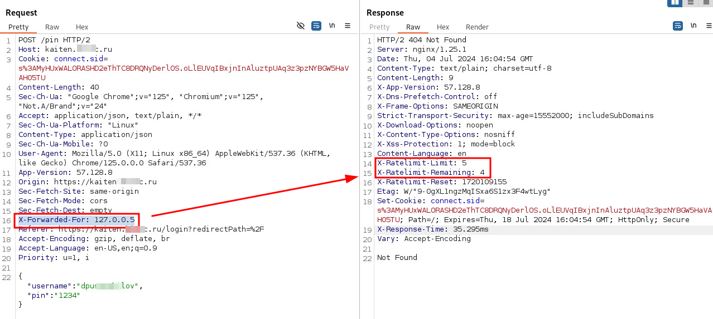
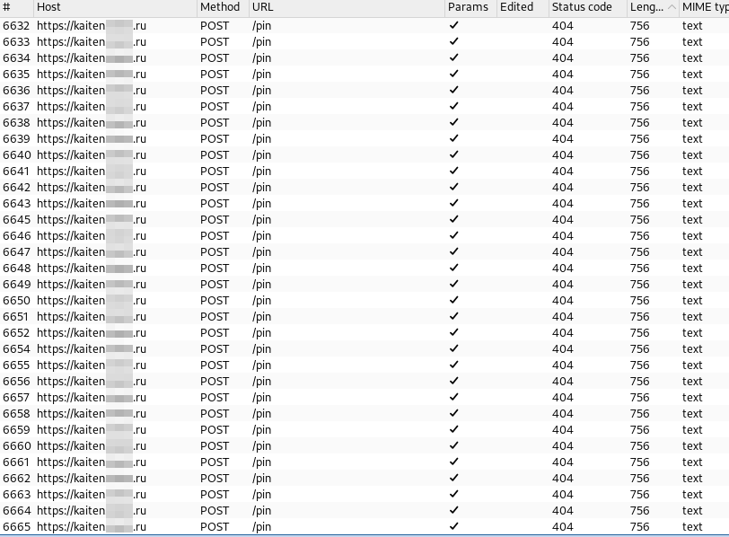
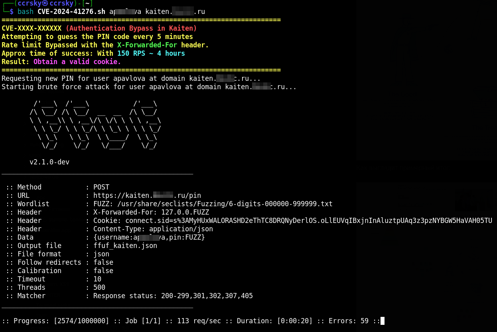

# CVE-2024-41276 (Kaiten Authentication Bypass)
[Kaiten](https://kaiten.ru/) - a workflow management system.
A vulnerability in Kaiten allows attackers to bypass the PIN code authentication mechanism. The application requires users to input a 6-digit PIN code sent to their email for authorization after entering their login credentials. However, the request limiting mechanism can be easily bypassed, enabling attackers to perform a brute force attack to guess the correct PIN and gain unauthorized access to the application.

**Details:**

Authentication mechanism use one factor sended on e-mail, without any password :)
Bypassing rate limits can be achieved by using the `X-Forwarded-For` header, which allows the `X-RateLimit-Remaining` counter to reset.



This method enables continued requests without receiving `HTTP 429 Too Many Requests` responses, which usually occur after multiple attempts. 



So also there are no limits to request new PIN Code => attacker can guess pin code using brute force attack. Expiry time of PIN Code 5 minutes, there are attacker have got 5 minutes to try guess 6-digit PIN-Code.
With **~150 RPS** attacker can try **~45,000** PIN Codes. After all attempts with math calculcation success probability 50% can be reached with 33 minutes and 100% with 4 hours.


**Vulnerable versions:**

`<= 57.131.12`


**Links:**

[CVE MITRE Description](https://cve.mitre.org/cgi-bin/cvename.cgi?name=CVE-2024-41276)

[NVD CVE](https://nvd.nist.gov/vuln/detail/CVE-2024-41276)

## Usage
Simple download bash script and run with selected username _(only login, not e-mails!)_

```bash
bash CVE-2024-41276.sh  <input_user> <kaiten.example.com>
```
As Result:
Successfull result => Obtain a valid cookie to futher usage




## Mitigation
- Update Kaiten software to last version
- Implement basic CAPTCHA or rate limits
- Block IP-address temporary
